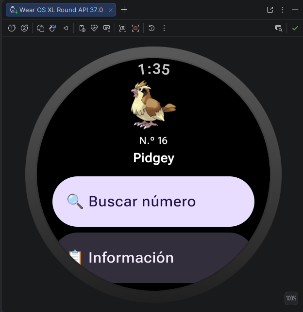
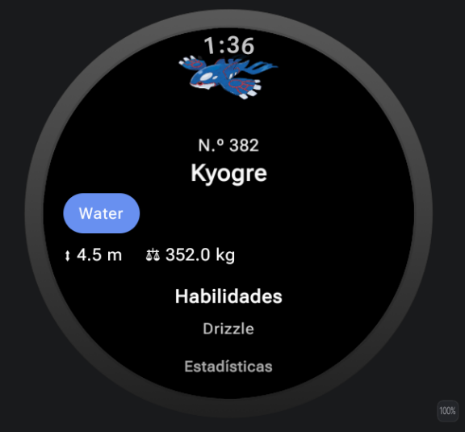
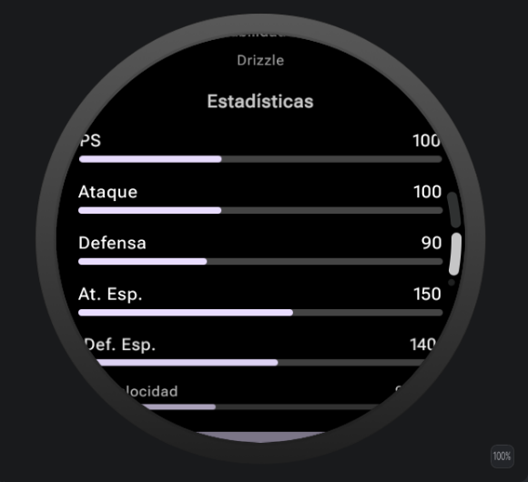

# Pokémon Wear OS

*Aplicación para Wear OS que consulta la PokéAPI*

## Integrantes

- Jonathan Maldonado Montejo
- Alexis Díaz Samudio
- Vilna Sabina Muñiz León
- Ruth Reyes De La Cruz

## Descripción breve de la aplicación

Pokémon Wear OS es una aplicación para relojes inteligentes con Wear OS que permite consultar información de Pokémon directamente desde la muñeca. Al abrir la app se carga un Pokémon aleatorio; desde la pantalla principal el usuario puede buscar cualquier Pokémon por su número (del 1 al 1025) mediante una rueda giratoria compatible con la corona o el bisel del reloj, y consultar una pantalla de detalle con su imagen oficial, tipos, altura, peso, habilidades y estadísticas base. El diseño está construido con Jetpack Compose para Wear OS, por lo que se adapta automáticamente a relojes de pantalla redonda o cuadrada, y de distintos tamaños.

## Tecnologías utilizadas

- Kotlin
- Jetpack Compose for Wear OS (Material 3)
- Kotlin Coroutines (llamadas de red asíncronas)
- Coil (carga de imágenes desde internet)
- Android Studio y Gradle (Kotlin DSL)
- Wear OS SDK (minSdk 30 / targetSdk 36)

## API utilizada

[PokéAPI](https://pokeapi.co/api/v2/pokemon/ditto) — API REST pública y gratuita que provee toda la información de los Pokémon en formato JSON: nombre, sprites/artwork oficial, tipos, altura, peso, habilidades y estadísticas base. La app consulta el endpoint `https://pokeapi.co/api/v2/pokemon/{id}` para obtener los datos de un Pokémon específico.

## Instrucciones básicas para ejecutar el proyecto

1. Abrir la carpeta del proyecto (`Pokemon/`) en Android Studio.
2. Esperar a que Gradle sincronice las dependencias automáticamente.
3. Crear o seleccionar un dispositivo virtual de Wear OS desde el Device Manager (por ejemplo, "Wear OS Large Round"), o conectar un reloj físico con Wear OS en modo desarrollador.
4. Ejecutar la app con el botón Run ▶ (o Shift+F10) seleccionando ese dispositivo.
5. Verificar que el reloj tenga conexión a internet, ya que la app consulta la PokéAPI en tiempo real.
6. En la app: usar el botón "Buscar número" para elegir un Pokémon con la rueda, y el botón "Información" para ver todos sus datos.

## Link del repositorio

<https://github.com/Jeanne120970/Pokemon-.git>

## Captura de pantalla de la aplicación funcionando

| Pantalla principal | Detalle del Pokémon | Estadísticas |
|:---:|:---:|:---:|
|  |  |  |
